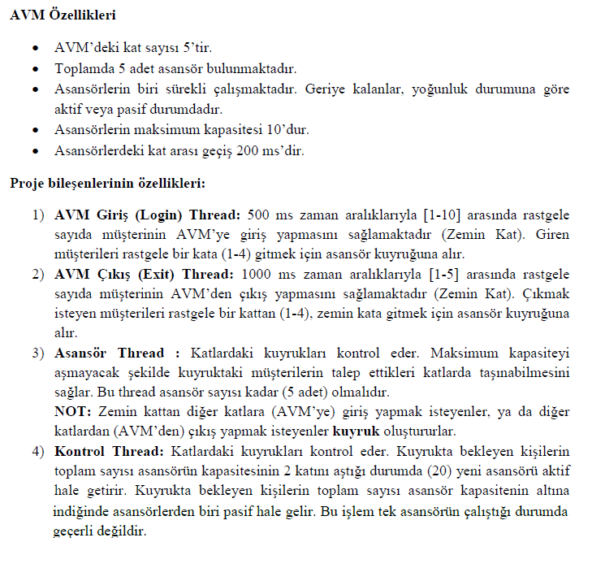

# ASANSÖRLERDEKİ TALEP YOĞUNLUĞUNUN MULTITHREAD İLE KONTROLÜ

## Projenin Amacı:
**Projenin amacı bir AVM’deki asansörlere gelen isteklerdeki yoğunluğu, multithread kullanarak diğer asansörlerle birlikte azaltmaktır.**
  

### Ekran Görüntüsü

